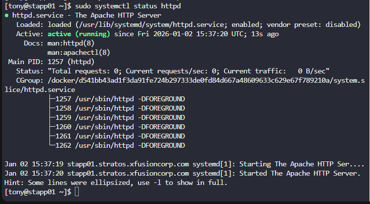

#  Linux Process Troubleshooting

##  Task Overview

The production support team of **xFusionCorp Industries** deployed monitoring tools to track the health of services across the **Stratos Datacenter**.
One of the monitoring systems reported that the **Apache (httpd) service was unavailable** on one of the application servers.

###  Objective

* Identify the faulty application server
* Fix the issue preventing Apache from starting
* Ensure **Apache is running on port `8084`** on **all app servers**
* No application code is required; only service availability matters

---

## Steps

### 1. Login to the App Server

```bash
ssh tony@stapp01
```

### 2. Check Apache Service Status

```bash
sudo systemctl status httpd
```

Observed output:

```text
Active: failed (Result: exit-code)
(98) Address already in use
no listening sockets available
AH00015: Unable to open logs
```

### 3. Identify the Root Cause

The error indicates a **port conflict**.
Apache cannot start because the configured port is already in use.

Check which service is using port `8084`:

```bash
sudo ss -lntp | grep 8084
```

Output showed:

```text
LISTEN 127.0.0.1:8084 users:(("sendmail",pid=700))
```

 **Root cause:**
`sendmail` service was already listening on port `8084`, preventing Apache from binding to the port.

[](../screenshots/Screenshot-day-14-port-8084-occupied-by-mail-service.png)


### 4. Stop and Disable the Conflicting Service

Since mail service is **not required** for this task, it was safely stopped.

```bash
sudo systemctl stop sendmail
sudo systemctl disable sendmail
```

### 5. Verify Apache Configuration

Ensure Apache is configured to listen on the correct port.

Edit the Apache configuration file:

```bash
sudo vi /etc/httpd/conf/httpd.conf
```

Confirmed configuration:

```apache
#Listen 12.34.56.78:80
Listen 8084
```

[](../screenshots/Screenshot-day-14-apache-configuration-set-to-listen-on-port-8084.png)

### 6. Start and Enable Apache Service

```bash
sudo systemctl start httpd
sudo systemctl enable httpd
```

Verify status:

```bash
sudo systemctl status httpd
```

Expected result:

```text
Active: active (running)
```

[](../screenshots/Screenshot-day-14-apache-service-successfully-running-and-enabled.png)

### 7. Confirm Apache is Listening on Port 8084

```bash
sudo ss -lntp | grep 8084
```

Expected output:

```text
LISTEN ... users:(("httpd",pid=XXXX))
```

### 8. Repeat on All App Servers

Apply the **same steps** on:

* `stapp02`
* `stapp03`

Ensure:

* Apache is **running**
* Apache is **enabled**
* Apache listens on **port 8084**

---

## 🧠 Good to Know

###  Apache (httpd)

Apache is a widely used open-source web server that listens on a specific port to handle HTTP requests.
Only **one service can bind to a port at a time**, so port conflicts are a common cause of startup failures.


###  Common Service Troubleshooting Commands

* Service status:

  ```bash
  systemctl status service-name
  ```

* Start / Stop service:

  ```bash
  systemctl start service-name
  systemctl stop service-name
  ```

* Enable service at boot:

  ```bash
  systemctl enable service-name
  ```


###  Port & Process Troubleshooting

* Check open ports:

  ```bash
  ss -lntp
  netstat -tulnp
  ```

* Find process using a port:

  ```bash
  lsof -i :PORT
  ```

* Stop conflicting service:

  ```bash
  systemctl stop service-name
  ```


###  Common Causes of Apache Failure

* Port conflicts (another service using the same port)
* Incorrect `Listen` configuration
* Permission issues
* Misconfigured or unavailable log directories
