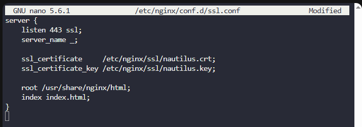

# Setup SSL for Nginx

The system admins team of **xFusionCorp Industries** needs to prepare **App Server 3** in the **Stratos Datacenter** for a new application deployment.

This task focuses on installing **NGINX**, configuring **HTTPS (SSL)** using a **self-signed certificate**, and validating secure access from the **jump host**.

---

##  Steps

### 1. Install and Start NGINX

Install NGINX on **App Server 3**:

```bash
sudo yum install -y nginx
```

Enable and start the service:

```bash
sudo systemctl enable nginx
sudo systemctl start nginx
```

Verify that NGINX is running:

```bash
systemctl status nginx
```

[](../screenshots/Screenshot-day-15-NGINX-service-running.png)

### 2. Move SSL Certificate and Key to a Secure Location

The SSL files were initially located in `/tmp`, which is **not suitable** for production use.

Create a secure directory:

```bash
sudo mkdir -p /etc/nginx/ssl
```

Move the certificate and key:

```bash
sudo mv /tmp/nautilus.crt /etc/nginx/ssl/
sudo mv /tmp/nautilus.key /etc/nginx/ssl/
```

Set correct permissions:

```bash
sudo chmod 600 /etc/nginx/ssl/nautilus.key
sudo chmod 644 /etc/nginx/ssl/nautilus.crt
```

**Explanation (simple):**

* `600` on the private key → only **root** can read/write it (security requirement)
* `644` on the certificate → readable by NGINX, but not modifiable by others
* This prevents unauthorized access to the **private key**, which is critical for SSL security

### 3. Configure SSL in NGINX

Edit the SSL configuration file:

```bash
sudo vi /etc/nginx/conf.d/ssl.conf
```

Add the following configuration:

```nginx
server {
    listen 443 ssl;
    server_name _;

    ssl_certificate     /etc/nginx/ssl/nautilus.crt;
    ssl_certificate_key /etc/nginx/ssl/nautilus.key;

    root /usr/share/nginx/html;
    index index.html;
}
```

**Explanation of this configuration (simple):**

* `listen 443 ssl;` → tells NGINX to accept **HTTPS traffic**
* `server_name _;` → default server, accepts requests for any hostname
* `ssl_certificate` → path to the public SSL certificate
* `ssl_certificate_key` → path to the private key used for encryption
* `root` → directory where the website files are stored
* `index index.html;` → default page served when accessing the site

[](../screenshots/Screenshot-day-15-SSL-configuration-file.png)

Test the NGINX configuration:

```bash
sudo nginx -t
```

[](../screenshots/Screenshot-day-15-Test-configuration-syntax.png)

Reload NGINX to apply changes:

```bash
sudo systemctl reload nginx
```

### 4. Create the Web Page

Create the `index.html` file under the NGINX document root:

```bash
sudo vi /usr/share/nginx/html/index.html
```

Add the following content:

```text
Welcome!
```

Save and exit.

### 5. Final Testing from Jump Host

From the **jump host**, test HTTPS access:

```bash
curl -Ik https://<APP_SERVER_3_IP>
```

Expected result:

```
HTTP/1.1 200 OK
Server: nginx
```

[](../screenshots/Screenshot-day-15-final-testing-from-Jump-Host.png)

✔ This confirms:

* SSL is working
* NGINX is serving content
* The server is ready for deployment

---

## 🧠 Good to Know

### Why Use SSL with NGINX?

* **Encryption**: Protects data exchanged between client and server
* **Security**: Prevents man-in-the-middle (MITM) attacks
* **Trust**: Browsers indicate secure connections with HTTPS
* **Modern Requirement**: Many applications require HTTPS by default

### SSL & Certificates Basics

* **Certificate (`.crt`)**: Contains public key and server identity
* **Private Key (`.key`)**: Used to encrypt/decrypt data and must be protected
* **Self-Signed Certificate**: Not trusted by browsers, but suitable for internal testing

### NGINX Best Practices

* Use `/etc/nginx/conf.d/*.conf` for site-specific configurations
* Always test configuration with `nginx -t` before reload
* Reload (`systemctl reload nginx`) applies changes without downtime
* Never store SSL keys in temporary directories like `/tmp`
