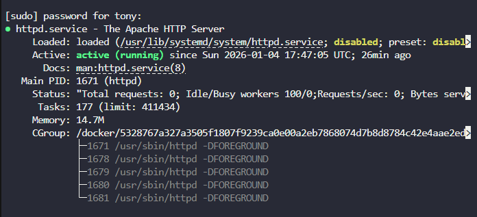
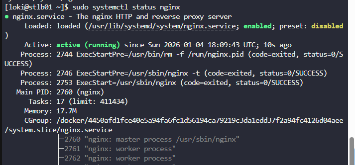
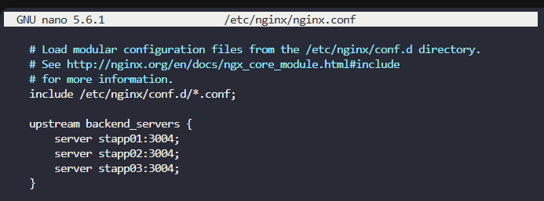

# ⚖️ Configure NGINX Load Balancer (High Availability Setup)

Day by day traffic was increasing on one of the websites managed by the **Nautilus production support team**, causing performance degradation.
To improve availability and scalability, the application was migrated to a **high availability architecture** in **Stratos DC**.

The final pending task was to configure the **LBR (Load Balancer) server** using **NGINX**, while keeping Apache unchanged on all application servers.

---

## 🛠️ Steps to Fix the Task

### 1- Enable and Verify Apache on All App Servers

Login to **App Server 1, App Server 2, and App Server 3** and ensure Apache (`httpd`) is running.

check Apache Service on App Server 

[](../Screenshot-day-016-apache-service-disable-on-app-server.png)

* The Apache service is currently disabled. Enable it by typing the following commands:

```bash
sudo systemctl start httpd
sudo systemctl enable httpd
systemctl status httpd
```
---

### 2- Identify the Apache Listening Port

Since the task explicitly states **not to change the Apache port**, we must first verify which port Apache is already using.

```bash
sudo ss -lntp | grep httpd
```

 Result observed:

* Apache is listening on **port 3004**
* Same configuration on all app servers

---

### 3- Install and Start NGINX on the LBR Server

Login to the **LBR server** and install NGINX.

```bash
sudo yum install -y nginx
sudo systemctl enable nginx
sudo systemctl start nginx
```

Verify NGINX status:

```bash
systemctl status nginx
```

[](../screenshots/Screenshot-day-16-NGINX-service-running-on-LBR-server.png)

---

### 4- Configure Load Balancing in `/etc/nginx/nginx.conf`

⚠️ **Important:**
Only the **main NGINX configuration file** was modified, as required by the task.

Edit the file:

```bash
sudo nano /etc/nginx/nginx.conf
```

#### 🔹 Upstream Configuration (Backend Servers)

```nginx
upstream backend_servers {
    server stapp01:3004;
    server stapp02:3004;
    server stapp03:3004;
}
```

**Explanation:**

* Defines a pool of backend application servers
* Uses the **existing Apache port (3004)**
* Enables **round-robin load balancing** by default

---

#### 🔹 Server and Proxy Configuration

```nginx
server {
    listen 80;
    listen [::]:80;
    server_name _;
    root /usr/share/nginx/html;

    location / {
        proxy_pass http://backend_servers;
        proxy_set_header Host $host;
        proxy_set_header X-Real-IP $remote_addr;
        proxy_set_header X-Forwarded-For $proxy_add_x_forwarded_for;
        proxy_set_header X-Forwarded-Proto $scheme;

        proxy_http_version 1.1;
        proxy_set_header Upgrade $http_upgrade;
        proxy_set_header Connection "upgrade";

        proxy_connect_timeout 5s;
        proxy_read_timeout 60s;
    }
}
```

**Explanation of Key Directives:**

* `proxy_pass` → forwards requests to backend app servers
* `Host` header → preserves original domain name
* `X-Real-IP` → keeps the real client IP
* `X-Forwarded-For` → tracks request path across proxies
* `proxy_connect_timeout` → avoids hanging connections
* `proxy_read_timeout` → controls backend response wait time

---

[](../screenshots/Screenshot-day-16-NGINX-configuration-file-server.png)

### 5- Validate and Reload NGINX Configuration

Check syntax:

```bash
sudo nginx -t
```

Reload NGINX:

```bash
sudo systemctl reload nginx
```

[](../screenshots/Screenshot-day-16-NGINX-configuration-syntax-check.png)

---

### 6- Final Testing

* Access the application using the **StaticApp** button
* Confirm the page loads successfully
* Requests are now distributed across all app servers

[](../screenshots/Screenshot-day-16-final-application-access-via-load-balancer.png)

---

##  Good to Know

### - Load Balancing Basics

**Simple definition : **
A **load balancer** is a server that receives all client requests and distributes them across multiple backend servers.

**Purpose:**
Distribute incoming traffic across multiple servers

**Benefits:**

* High availability
* Scalability
* Fault tolerance

**Default Algorithm:**

* **Round-robin** (requests are distributed sequentially)

**Other Algorithms:**

* **least_conn** → sends traffic to the least busy server
* **ip_hash** → same client always goes to the same server

**Session Awareness:**
Some applications require session persistence (sticky sessions)

---

### - NGINX Load Balancer Concepts

* **Upstream Block:** Defines a pool of backend servers
* **Proxy Pass:** Forwards client requests to upstream servers
* **Reverse Proxy Role:** NGINX hides backend servers from clients
* **Health Handling:** Automatically skips unreachable backend servers
* **Scalability:** New backend servers can be added without downtime
* **Central Control:** All traffic passes through a single control point (LBR)

---

### - What Is a Reverse Proxy?

**Simple definition**
A **reverse proxy** is a server that accepts client requests on behalf of backend servers and forwards those requests internally.

**Direction matters:**

| Proxy Type    | Who it hides     |
| ------------- | ---------------- |
| Forward Proxy | Hides the client |
| Reverse Proxy | Hides the server |

**In this setup:**

```
Client → NGINX → Apache
```

* The client thinks it communicates with NGINX
* Apache servers are hidden behind the reverse proxy

**Why reverse proxy is important:**

* Improves security by hiding backend servers
* Provides a central point for SSL termination
* Enables centralized logging and monitoring
* Makes load balancing possible

---

### - Proxy Headers

* **Host:** Preserves the original domain name requested by the client
* **X-Real-IP:** Allows backend servers to log the real client IP
* **X-Forwarded-For:** Tracks the full request path across proxies
* **X-Forwarded-Proto:** Indicates whether the original request used HTTP or HTTPS

**Importance:**
Required for logging, security rules, auditing, and application logic

---

### - Timeouts and Stability

* **proxy_connect_timeout:** Prevents NGINX from waiting too long to connect to backends
* **proxy_read_timeout:** Prevents hanging responses from slow servers

**Why Needed:**
Protects the load balancer from backend performance issues

**Result:**
More stable and predictable traffic handling

---

### - High Availability Outcome

* **Single Entry Point:** Clients access the application through the LBR server
* **Multiple Backends:** Traffic is shared across multiple app servers
* **Fault Tolerance:** If one app server fails, others continue serving traffic
* **Zero-Downtime Scaling:** Servers can be added or removed dynamically
* **Improved Performance:** Better response times under high traffic

---

### - Operational & Troubleshooting Tips

* Always verify backend services **before** configuring the load balancer
* Use `ss -lntp` to confirm which ports services are listening on
* Use `curl backend_ip:port` from the LBR server to test connectivity
* Run `nginx -t` before reloading configuration
* Check logs for errors and access details:

  * `/var/log/nginx/error.log`
  * `/var/log/nginx/access.log`

