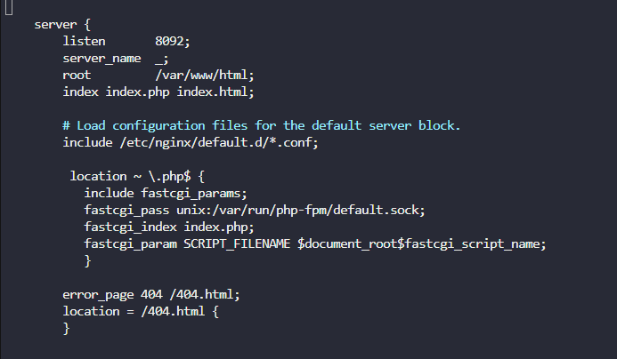

# Configure Nginx & PHP-FPM Using Unix Socket

The Nautilus application development team is planning to launch a new PHP-based application, which they want to deploy on Nautilus infra in Stratos DC. The development team had a meeting with the production support team and they have shared some requirements regarding the infrastructure. Below are the requirements they shared:

* Install `nginx` on `app server 1`, configure it to use port `8092` and its document `root` should be `/var/www/html`.
* Install `php-fpm` version `8.2` on `app server 1`, it must use the unix socket `/var/run/php-fpm/default.sock` (create the parent directories if don't exist).
* Configure `php-fpm` and `nginx` to work together.
* Once configured correctly, you can test the website using
  `curl http://stapp01:8092/index.php` command.

> **Note**: Application files (`index.php`, `info.php`) already exist in `/var/www/html` and were not modified.

---

## Steps

### 1. Login into App Server and install required packages

```sh
sudo yum install -y nginx
sudo dnf module install php:8.2 -y
```

* Installs **nginx**
* Installs **PHP 8.2 and PHP-FPM** using DNF module (CentOS Stream 9)

### 2. Configure PHP-FPM to use Unix socket

```sh
sudo mkdir -p /var/run/php-fpm
sudo vi /etc/php-fpm.d/www.conf
```

Update the following lines:

```ini
listen = /var/run/php-fpm/default.sock
listen.owner = nginx
listen.group = nginx
listen.mode = 0660

user = nginx
group = nginx
```

* Ensures PHP-FPM listens on the required Unix socket
* Allows nginx to access the socket

### 3. Configure Nginx

```sh
sudo vi /etc/nginx/nginx.conf
```

* Change listening port from `80` to `8092`
* Set document root to `/var/www/html`
* Enable PHP processing via Unix socket

Example server block:

```nginx
server {
    listen 8092;
    server_name _;

    root /var/www/html;
    index index.php index.html;

    include /etc/nginx/default.d/*.conf;

    location ~ \.php$ {
        include fastcgi_params;
        fastcgi_pass unix:/var/run/php-fpm/default.sock;
        fastcgi_index index.php;
        fastcgi_param SCRIPT_FILENAME $document_root$fastcgi_script_name;
    }

    error_page 404 /404.html;
    location = /404.html {
    }
}
```

### Explanation of the added configuration

* `listen 8092;` : Configures nginx to listen on **port 8092**, as required by the application.

* `server_name _;` : Acts as a **default server**, accepting requests for any hostname.

* `root /var/www/html;` : Sets the **document root** where the PHP application files (`index.php`, `info.php`) are located.

* `index index.php index.html;` : Allows nginx to load **`index.php` by default** when accessing the root URL.

* `include /etc/nginx/default.d/*.conf;` : Loads additional default nginx configuration files.

* `location ~ \.php$ { ... }` : Matches all `.php` files and sends them to **PHP-FPM** for execution.

* `fastcgi_pass unix:/var/run/php-fpm/default.sock;` : Connects nginx to PHP-FPM using a **Unix socket** for fast local communication.

* `fastcgi_param SCRIPT_FILENAME ...` : Passes the correct PHP file path to PHP-FPM for execution.

* `error_page 404 /404.html;` : Defines a custom page for **404 (Not Found)** errors.


[](../Screenshot-day-20-configure-nginx.png)

### 4. Enable and start services

```sh
sudo systemctl enable --now nginx
sudo systemctl enable --now php-fpm
```

* Starts services immediately
* Enables services on boot

### 5. Test the application

```sh
curl http://stapp01:8092/index.php
```

Expected output:

```text
Welcome to xFusionCorp Industries!
```

[](../screenshots/Screenshot-day-20-test-the-application.png)

---

## 🧠 Good to Know

### PHP-FPM (FastCGI Process Manager)

* **Purpose**: High-performance PHP execution
* **Process Management**: Manages multiple PHP worker processes
* **Stability**: PHP crashes do not affect nginx
* **Efficiency**: Better resource usage than mod_php

### NGINX + PHP-FPM Benefits

* **Scalability**: Handles many concurrent requests
* **Performance**: Non-blocking architecture
* **Isolation**: Web server and PHP run separately
* **Flexibility**: Easy to change PHP versions

### Configuration Best Practices

* Ensure correct socket permissions
* Run PHP-FPM as the `nginx` user
* Always test configuration with `nginx -t`
* Monitor logs:
  `/var/log/nginx/error.log`
  `/var/log/php-fpm/error.log`
