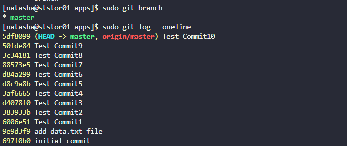

# Git hard reset

The Nautilus application development team was working on a git repository `/usr/src/kodekloudrepos/apps` present on the Storage server in Stratos DC. This repository was used only for testing purposes, and multiple test commits were pushed by a developer. The team decided to clean the repository completely by removing unnecessary commits and resetting both the **HEAD** and the **branch** to a specific earlier commit with the message `add data.txt file`.

## Requirements

* In `/usr/src/kodekloudrepos/apps` git repository, reset the commit history so that **only two commits remain**:

  * `initial commit`
  * `add data.txt file`
* Push the updated history to the remote repository.

---

## Steps

### 1. Log in to the Storage Server and Navigate to Repository

```sh
ssh natasha@172.16.238.15
cd /usr/src/kodekloudrepos/apps
```

### 2. Verify Current Branch

```sh
sudo git branch
```

```shell
* master
```

### 3. Check Commit History

```sh
sudo git log --oneline
```

[](../screenshots/Screenshot-day-30-git-log.png)

### 4. Reset Repository to Required Commit

reset to the required commit:

```sh
sudo git reset --hard 9e9d3f9
```

### 5. Verify Clean Commit History

```sh
sudo git log --oneline
```

[](../screenshots/Screenshot-day-30-verify-git-reset.png)

### 6. Force Push Changes to Remote Repository

Since commit history was rewritten, a force push is required:

```sh
sudo git push --force
```

---

## Good to Know

### Git Reset Types

* **Soft** (`--soft`)
  Moves HEAD only, keeps staging area and working directory.
* **Mixed** (`--mixed`, default)
  Moves HEAD and resets staging area.
* **Hard** (`--hard`)
  Resets HEAD, staging area, and working directory completely.

### Important Warnings

* `git reset --hard` permanently removes commits.
* `git push --force` rewrites shared history.
* Use this approach **only for test or controlled repositories**.

### Recovery Options

* View previous HEAD states:

  ```sh
  git reflog
  ```
* Restore from reflog:

  ```sh
  git reset --hard HEAD@{n}
  ```