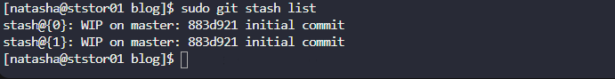

#  Git Stash

The Nautilus application development team was working on a Git repository located at
`/usr/src/kodekloudrepos/blog` on the Storage server in Stratos DC.

One of the developers had stashed some in-progress changes in this repository. The task was to **restore a specific stash (`stash@{1}`), commit the restored changes, and push them to the origin repository**.

---

## Task Requirements

* Locate stashed changes in the Git repository
* Restore the stash with identifier `stash@{1}`
* Commit the restored changes
* Push the commit to the `origin` repository

---

## Steps

### 1. Login to Storage Server and Navigate to Repository

```sh
ssh natasha@172.16.238.15
cd /usr/src/kodekloudrepos/blog
```

### 2. Check Available Stashes

```sh
sudo git stash list
```

[](../screenshots/Screenshot-day-31-stash-list.png)

### 3. Restore the Required Stash

```sh
sudo git stash apply stash@{1}
```

**Result:**

```text
Changes to be committed:
  new file: welcome.txt
```

### 4. Stage the Restored Files

```sh
sudo git add *
```

### 5. Commit the Changes

```sh
sudo git commit -m "Restored stash"
```

### 6. Push Changes to Origin

```sh
sudo git push
```

---

## Good to Know

### Git Stash Purpose

* **Temporary Storage**: Save work-in-progress without committing
* **Clean Working Tree**: Allows switching branches safely
* **Quick Recovery**: Restore changes at any time
* **Untracked Files**: Can store new files when required

### Common Git Stash Commands

* **Create stash**:

  ```sh
  git stash
  ```
* **Create stash with message**:

  ```sh
  git stash push -m "message"
  ```
* **List stashes**:

  ```sh
  git stash list
  ```
* **Apply stash (keep stash)**:

  ```sh
  git stash apply stash@{n}
  ```
* **Pop stash (apply + remove)**:

  ```sh
  git stash pop stash@{n}
  ```
* **Drop stash**:

  ```sh
  git stash drop stash@{n}
  ```

---

### Advanced Stash Usage

* **Include untracked files**:

  ```sh
  git stash -u
  ```
* **Include ignored files**:

  ```sh
  git stash -a
  ```
* **View stash changes**:

  ```sh
  git stash show -p stash@{n}
  ```
* **Create branch from stash**:

  ```sh
  git stash branch <branch-name>
  ```
