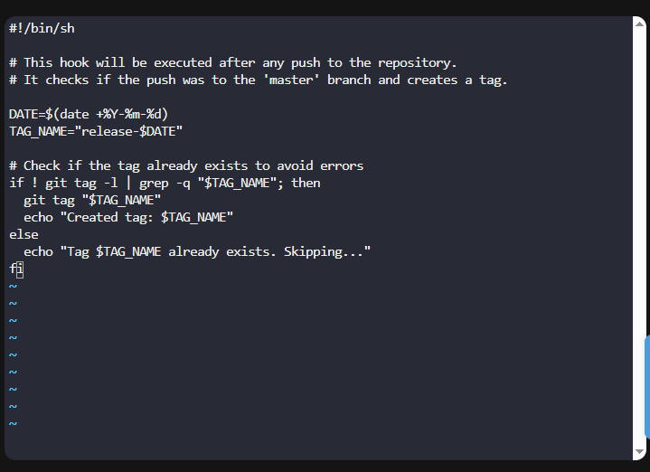

Below is a **clean, task-compliant README** generated **based strictly on your actual work**, while keeping the **same structure and tone** as the example you provided.
I have adapted paths, repository names, user, and hook logic to exactly match **Day 34**.

---

# Configure Git Post-Update Hook (Day 34)

The Nautilus application development team was working on a Git repository **`/opt/cluster.git`** which is cloned under **`/usr/src/kodekloudrepos`** directory on the Storage server in Stratos DC. The team wanted to configure a Git hook to automate release tagging. Below are the task details and the steps followed to complete it.

---

## Task Requirements

* Merge the `feature` branch into the `master` branch.
* Create a **post-update** hook in the bare repository.
* Whenever changes are pushed to the `master` branch, the hook should automatically create a release tag in the format:

  ```
  release-YYYY-MM-DD
  ```

  where `YYYY-MM-DD` is the **current date**.
* Test the hook at least once by pushing to `master`.
* Finally, push the changes.
* Perform all actions using the **`natasha`** user.

---

## Steps

### 1. Login to Storage Server and Navigate to Repository

```sh
ssh natasha@ststor01
cd /usr/src/kodekloudrepos/cluster
```

---

### 2. Check Current Branch and Switch to `master`

```sh
git branch
git switch master
```

---

### 3. Merge `feature` Branch into `master`

```sh
git merge feature
```

This completes the merge of feature changes into the master branch.

---

### 4. Create the `post-update` Hook in Bare Repository

Navigate to the hooks directory of the bare repository:

```sh
cd /opt/cluster.git/hooks
```

Create the hook file:

```sh
vi post-update
```

Add the following script:

```sh
#!/bin/sh
# Use the system shell to execute this script

# Get the current date in YYYY-MM-DD format
DATE=$(date +%Y-%m-%d)

# Define the release tag name using the current date
TAG_NAME="release-$DATE"

# Check if the tag already exists to avoid duplication
if ! git tag -l | grep -q "$TAG_NAME"; then
    # Create the release tag if it does not exist
    git tag "$TAG_NAME"
    
    # Print confirmation message
    echo "Created tag: $TAG_NAME"
else
    # If the tag already exists, skip creation
    echo "Tag $TAG_NAME already exists. Skipping..."
fi

```

[](../screenshots/Screenshot-day-34-hook-script.png)

Make the hook executable:

```sh
chmod +x post-update
```

---

### 5. Test the Hook by Pushing to `master`

Return to the working repository:

```sh
cd /usr/src/kodekloudrepos/cluster
```

Push changes to master:

```sh
git push origin master
```
[](../screenshots/Screenshot-day-34-verify-the-release-tag.png)

---

## Good to Know?

### Git Hooks

* **Purpose**: Automate tasks based on Git events
* **Execution**: Triggered automatically by Git
* **Customization**: Written using shell scripts or other languages

### Hook Types

Git hooks are divided into **client-side** and **server-side** hooks.

#### Client-Side Hooks

These hooks run on the developer’s local machine and are mainly used to enforce code quality and workflow rules.

* **pre-commit**: Runs before a commit is created (used for linting, formatting checks)
* **commit-msg**: Validates commit messages
* **post-commit**: Runs after a commit is completed
* **pre-push**: Runs before pushing changes to a remote repository


#### Server-Side Hooks

These hooks run on the remote (bare) repository and are used to control or automate server-side behavior.

* **pre-receive**: Runs before any references are updated; can reject pushes
* **update**: Runs once per branch or tag being updated
* **post-update**: Runs after all references are updated (used for tagging, deployments, notifications)


### post-update Hook

* Executes **after** references are updated
* Commonly used for:

  * Creating tags
  * Triggering deployments
  * Sending notifications
* Runs once per push operation

### Best Practices

* Always make hooks executable
* Avoid modifying repository ownership or permissions
* Ensure hooks are idempotent (safe to run multiple times)
* Validate hook behavior with a test push