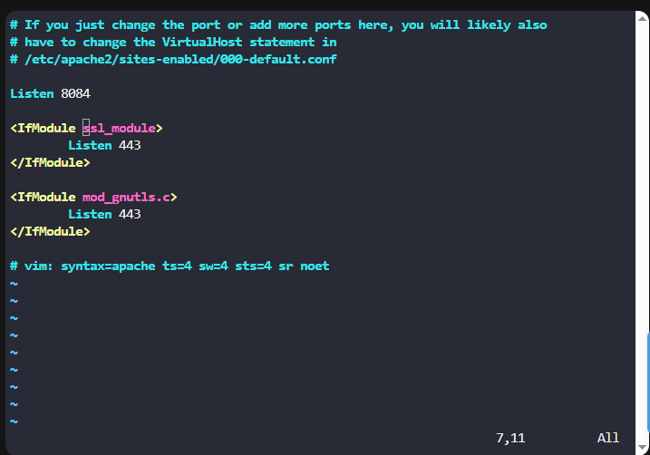
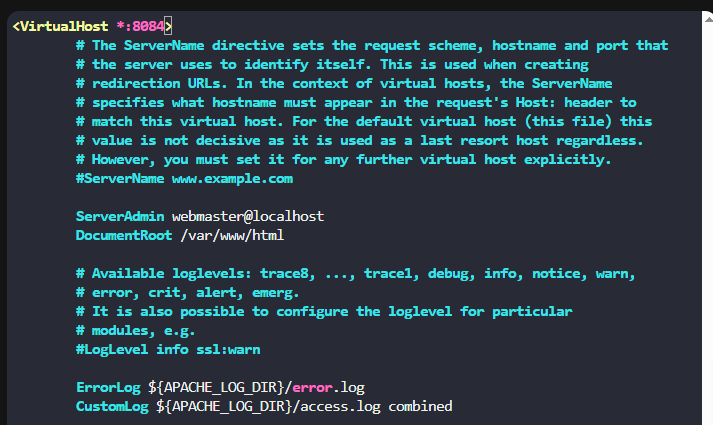

# Docker EXEC Operations

One of the Nautilus DevOps team members was working to configure services on a **kkloud** container that is running on **App Server 1** in the **Stratos Datacenter**. Due to personal reasons, the work had to be completed by another engineer.

This document explains the steps taken to complete the pending task successfully.

---

## Task Requirements

* Install **apache2** in the `kkloud` container using `apt`
* Configure **Apache** to listen on port **8084** instead of the default HTTP port
* Apache must listen on **all interfaces** (not bound to a specific IP)
* Ensure **Apache service is running**
* Keep the container in a **running state**

---

## Steps

### 1. Login to App Server 1

```sh
ssh tony@172.16.238.10
```

### 2. Verify Running Container

```sh
docker ps -a
```

```text
CONTAINER ID   IMAGE          COMMAND       CREATED         STATUS         PORTS     NAMES
2252e4c1c0be   ubuntu:18.04   "/bin/bash"   5 minutes ago   Up 5 minutes             kkloud
```

### 3. Access the Container as Root

```sh
docker exec -it -u 0 2252e4c1c0be /bin/bash
```

```text
root@2252e4c1c0be:/#
```

### 4. Install Apache and Vim

```sh
apt update
apt install apache2 vim -y
```

> Apache2 and Vim are now installed inside the container.

### 5. Configure Apache to Listen on Port 8084

#### 5.1 Update `ports.conf`

```sh
vi /etc/apache2/ports.conf
```

**Before**

```apache
Listen 80
```

**After**

[](../screenshots/Screenshot-day-40-apache-port-configuration.png)

> No IP address is specified, so Apache listens on all interfaces.

#### 5.2 Update Default Virtual Host

```sh
vi /etc/apache2/sites-enabled/000-default.conf
```

**Before**

```apache
<VirtualHost *:80>
```

**After**

[](../screenshots/Screenshot-day-40-apache-default-virtual-host-configuration.png)

### 6. Start and Restart Apache Service

Since `systemctl` is not available inside the container, Apache is managed using `service` or `apache2ctl`.

```sh
/usr/sbin/apache2ctl start
```

Restart Apache to apply configuration changes:

```sh
service apache2 restart
```

Check service status:

```sh
service apache2 status
```

```text
* apache2 is running
```

> The warning about `ServerName` is expected in containers and does not affect functionality.


---

## Good to Know

### Docker Exec

* `docker exec -it` allows interactive access to running containers
* `-u 0` ensures root privileges inside the container

### Apache Inside Containers

* `systemctl` is usually unavailable
* Use `service apache2` or `apache2ctl`
* FQDN warnings are normal in container environments

### Container Persistence

* Changes inside containers are **ephemeral**
* Data is lost if the container is removed
* Use Dockerfiles or volumes for long-term persistence


