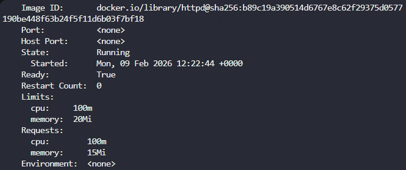

# Day 50 – Set Resource Limits in Kubernetes Pods

The Nautilus DevOps team observed performance issues due to missing resource constraints in some Kubernetes workloads.
To address this, a Pod was created with defined **CPU and memory requests and limits**.

---

##  Task Requirements

* Create a Pod
* Container image: `httpd:latest`
* Container name: `httpd-container`
* Resource configuration:

  * **Requests**

    * Memory: `15Mi`
    * CPU: `100m`
  * **Limits**

    * Memory: `20Mi`
    * CPU: `100m`

---

#  Steps

## 1. Create the Pod Definition File

File: `httpd-pod.yml`

```yaml
apiVersion: v1
kind: Pod
metadata:
  name: limit-pod
spec:
  containers:
    - name: httpd-container
      image: httpd:latest
      resources:
        requests:
          memory: "15Mi"
          cpu: "100m"
        limits:
          memory: "20Mi"
          cpu: "100m"
```

## 2. Apply the Configuration

```bash
kubectl apply -f httpd-pod.yml
```

## 3. Verify Pod Status

```bash
kubectl get pods
```

Result:

[](../screenshots/Screenshot-day-50-verify-pod-status.png)

## 4. Validate Resource Configuration

```bash
kubectl describe pod limit-pod
```
[](../Screenshot-day-50-validate-resource-configuration.png)

---

#  Good to Know

##  Resource Management

* **Requests**: Minimum amount of CPU and memory guaranteed to a container.
* **Limits**: Maximum amount of CPU and memory a container can consume.
* **Quality of Service (QoS)**:

  * **BestEffort** – No requests or limits defined.
  * **Burstable** – Requests < Limits.
  * **Guaranteed** – Requests = Limits (for both CPU and Memory).
* **Resource Types**:

  * **CPU** (measured in cores or millicores)
  * **Memory** (measured in bytes)
  * **Ephemeral Storage**


##  CPU Resources

* **Units**:

  * `1000m = 1 CPU core`
  * `100m = 0.1 core`
* **Fractional CPU**: * Allows precise allocation (e.g., 250m = 0.25 CPU).
* **Throttling**:* If a container exceeds its CPU limit, it is throttled.
* **Scheduling**: * CPU requests determine pod placement on nodes.


##  Memory Resources

* **Units**:

  * `Ki`, `Mi`, `Gi`
* **OOM Killer**:

  * If a container exceeds its memory limit, it is terminated (OOMKilled).
* **Non-compressible**:

  * Memory cannot be throttled like CPU.
* **Eviction**:

  * Pods may be evicted under node memory pressure.


##  Resource Planning

* **Monitoring**: Track real resource usage using metrics tools.
* **Right-sizing**: Avoid over-provisioning or under-provisioning resources.
* **Node Capacity**:  Ensure nodes have enough allocatable resources.
* **Cluster Autoscaling**: Automatically scale nodes based on workload demand.
