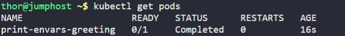

# Print Environment Variables

The Nautilus DevOps team needs to validate a sample configuration that prints greeting messages using environment variables inside a Kubernetes Pod.

This task focuses on:

* Creating a Pod
* Injecting environment variables
* Executing a shell command
* Understanding Pod lifecycle behavior

---

##  Task Requirements

* Create a pod named `print-envars-greeting`

* Container name must be `print-env-container`

* Use `bash` image

* Define the following environment variables:

  * `GREETING` → `Welcome to`
  * `COMPANY` → `Stratos`
  * `GROUP` → `Ltd`

* Use the exact command:

  ```bash
  ["/bin/sh", "-c", 'echo "$(GREETING) $(COMPANY) $(GROUP)"']
  ```

* Set:

  ```yaml
  restartPolicy: Never
  ```

* Verify output using:

  ```bash
  kubectl logs -f print-envars-greeting
  ```

---

#  Steps 

### 1. Create the YAML file

Create the file:

```bash
vi print-envars-greeting.yaml
```

Use the configuration provided in the [print-envars-greeting.yaml](../files/k8s_print_envars_57d.yml).

### 2. Apply the Pod

```bash
kubectl apply -f print-envars-greeting.yaml
```

### 3. Verify Pod Status

```bash
kubectl get pods
```

[](../screenshots/Screenshot-day-57-verify-pod-status.jpg)


### 4. Check the Logs

```bash
kubectl logs -f print-envars-greeting
```
[](../screenshots/Screenshot-day-57-check-the-logs.jpg)

---

#  Good to Know

##  How Environment Variables Work in Containers

* Environment variables are injected at container start time.
* They are available only inside that container.
* If the container restarts, variables are reloaded from the Pod spec.
* They do **not** change dynamically unless the Pod is recreated.

---

##  Why `/bin/sh -c` Is Required

When using:

```bash
echo "$(GREETING) $(COMPANY) $(GROUP)"
```

The variable expansion is handled by a **shell interpreter**.

Without:

```yaml
"/bin/sh", "-c"
```

Kubernetes would try to execute `echo` directly, and variable expansion would fail.


##  Pod Phases Explained

When you run this Pod, you will see:

```
Pending → Running → Completed
```

* **Pending** → Kubernetes is scheduling the Pod
* **Running** → Container process is executing
* **Completed** → Process exited successfully (exit code 0)

This is expected behavior for short-lived workloads.


##  restartPolicy Behavior

Kubernetes supports three restart policies:

| Policy    | Behavior                                         |
| --------- | ------------------------------------------------ |
| Always    | Restarts container after exit (default for Pods) |
| OnFailure | Restarts only if exit code ≠ 0                   |
| Never     | Never restarts container                         |

For one-time execution tasks like this, `Never` is the correct choice.


##  Why This Is Not a Deployment

This task uses a **Pod**, not a Deployment, because:

* It is not a long-running service.
* It does not need scaling.
* It does not require replica management.

In production, one-time tasks should use a **Job** instead of a raw Pod.


##  Inspecting Exit Code

You can inspect container termination details using:

```bash
kubectl describe pod print-envars-greeting
```

Look for:

```
Exit Code: 0
Reason: Completed
```

Exit code `0` means successful execution.


##  Production Best Practices

Even for simple Pods:

* Define CPU and memory requests/limits
* Use ConfigMaps for non-sensitive configuration
* Use Secrets for sensitive data
* Avoid hardcoding values in manifests


##  Core Kubernetes Concept Reinforced

> A container lives as long as its main process (PID 1) runs.

When the main process exits:

* The container stops
* The Pod moves to `Succeeded`
* Kubernetes respects the restart policy

