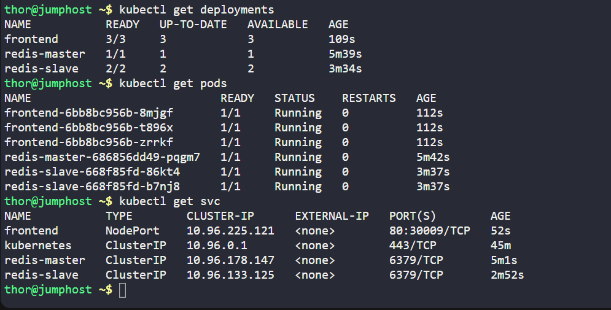

# Deploy Guest Book App on Kubernetes

The Nautilus Application development team has completed development of the Guestbook application. The application follows a **3-tier architecture** and must be deployed on a Kubernetes cluster.

The infrastructure includes:

* Redis Master (Backend)
* Redis Slave (Backend)
* PHP Frontend
* Internal Services for backend
* NodePort Service for frontend

---

#  Steps

## Architecture Summary

We need to create:

* `redis-master` Deployment
* `redis-master` Service
* `redis-slave` Deployment
* `redis-slave` Service
* `frontend` Deployment
* `frontend` Service (NodePort 30009)

## 1. Create `redis-master-deployment.yaml`

```bash
vim redis-master-deployment.yaml
```

Paste the Redis Master deployment configuration [`redis-master_deploy file`](../files/k8s_redis_master_deploy_d67.yml).

Apply it:

```bash
kubectl apply -f redis-master-deployment.yaml
```

## 2. Create `redis-master-service.yaml`

```bash
vim redis-master-service.yaml
```

Paste the Redis Master service configuration [`redis_master_service file`](../files/k8s_redis_master_service_d67.yml).

Apply it:

```bash
kubectl apply -f redis-master-service.yaml
```

## 3. Create `redis-slave-deployment.yaml`

```bash
vim redis-slave-deployment.yaml
```

Paste the Redis Slave deployment configuration [`redis_slave_deploy file`](../files/k8s_redis_slave_deploy_d67.yml).

Apply it:

```bash
kubectl apply -f redis-slave-deployment.yaml
```

## 4. Create `redis-slave-service.yaml`

```bash
vim redis-slave-service.yaml
```

Paste the Redis Slave service configuration [`redis_slave_service file`](../files/k8s_redis_slave_service_d67.yml).

Apply it:

```bash
kubectl apply -f redis-slave-service.yaml
```

## 5. Create `frontend-deployment.yaml`

```bash
vim frontend-deployment.yaml
```

Paste the Frontend deployment configuration [`frontend_deploy file`](../files/k8s_frontend_deploy_d67.yml).

Apply it:

```bash
kubectl apply -f frontend-deployment.yaml
```

## 6. Create `frontend-service.yaml`

```bash
vim frontend-service.yaml
```

Paste the Frontend service configuration [`frontend_service file`](../files/k8s_frontend_service_d67.yml).

Apply it:

```bash
kubectl apply -f frontend-service.yaml
```

## 7. Final Verification

```bash
kubectl get deployments
kubectl get pods
kubectl get svc
```
[](../screenshots/Screenshot-day-67-verification.png)

---

#  Good to Know

##  Three-Tier Architecture

This deployment follows a classic production pattern:

* **Frontend Tier** → Handles user interface
* **Backend Tier** → Redis Master/Slave data layer
* **Service Layer** → Internal communication via Kubernetes Services

Each tier scales independently.


##  Redis Master-Slave Model

* Master handles **write operations**
* Slaves handle **read operations**
* Data replication improves availability
* Multiple slave replicas increase fault tolerance


##  Kubernetes Service Discovery

* Services are accessible via DNS inside cluster
* `GET_HOSTS_FROM=dns` enables DNS-based discovery
* Pods communicate using service names
* No hardcoded IP addresses required


##  Resource Management

Each container defines:

```
cpu: 100m
memory: 100Mi
```

This ensures:

* Controlled resource allocation
* Better scheduling
* Protection from noisy neighbor issues


##  NodePort Exposure

* Frontend is exposed using `NodePort`
* Port `30009` is externally accessible
* Backend services remain internal (ClusterIP)

This ensures secure separation between frontend and backend.


##  Kubernetes Best Practices Used

* Proper label and selector matching
* Replica-based scaling
* DNS-based service discovery
* Resource requests defined
* Clean separation of YAML files
