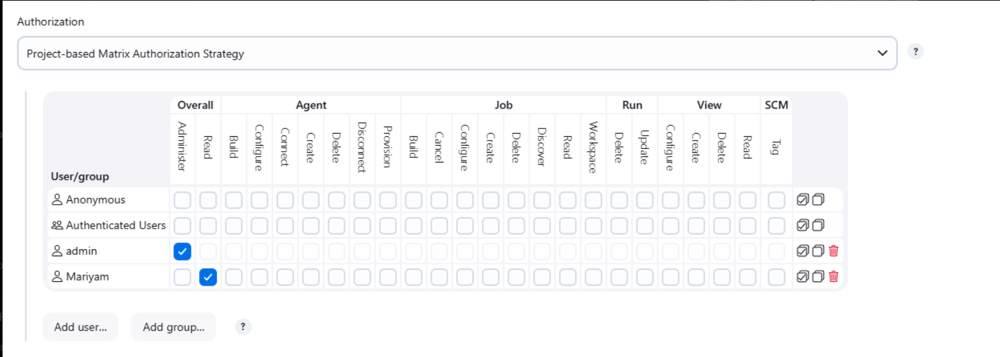
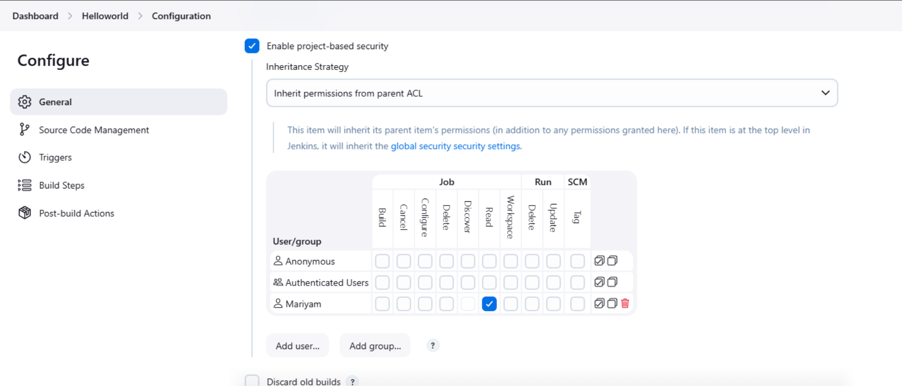

# Configure Jenkins User Access

The Nautilus DevOps team is integrating **Jenkins** into their CI/CD pipeline. After setting up the Jenkins server, they need to configure **secure user access** for developers.

In this task, a new user `mariyam` is created and given **limited permissions** using the **Project-based Matrix Authorization Strategy** to enforce proper access control.

---

# Task Requirements

1. Access the Jenkins UI and login with:

```
Username: admin
Password: Adm!n321
```

2. Create a new Jenkins user:

```
Username: mariyam
Password: GyQkFRVNr3
Full Name: Mariyam
```

3. Configure **Project-based Matrix Authorization Strategy** and assign:

```
mariyam → Overall Read
```

4. Remove all permissions for **Anonymous** users.

5. Ensure **admin** retains:

```
Overall → Administer
```

6. Configure the existing job so that:

```
mariyam → Job Read only
```

No other permissions (Build, Configure, SCM, Agent, etc.) should be granted.

---

# Steps

## 1. Login to Jenkins

Open the Jenkins UI and login using:

```
admin / Adm!n321
```

This will redirect to the Jenkins dashboard.

## 2. Create User Mariyam

Navigate to:

```
Manage Jenkins → Manage Users → Create User
```

Fill the user details:

```
Username: mariyam
Password: GyQkFRVNr3
Full Name: Mariyam
```

Click **Create User**.

## 3. Install Matrix Authorization Strategy Plugin

Navigate to:

```
Manage Jenkins → Manage Plugins → Available Plugins
```

Search and install:

```
Matrix Authorization Strategy
```

After installation:

 Restart Jenkins when installation completes.

Wait until the **login page appears again**, then login.

## 4. Configure Global Security

Go to:

```
Manage Jenkins → Configure Global Security
```

Under **Authorization**, select:

```
Project-based Matrix Authorization Strategy
```

Configure permissions:

### admin

```
Overall → Administer
```

### mariyam

```
Overall → Read
```

### Anonymous

```
No permissions
```

Save the configuration.

Example configuration:

[](../screenshots/Screenshot-day-70-project-based-matrix-authorization-strategy-jenkins.png)

## 5 — Configure Job-Level Permissions

Navigate to the existing job:

```
Dashboard → Helloworld → Configure
```

Enable:

```
Enable Project-based Security
```

Add user:

```
mariyam
```

Assign permission:

```
Job → Read
```

[](../screenshots/Screenshot-day-70-job-security.png)

---

# Good to Know

## Jenkins Security Concepts

Jenkins security is based on **Authentication** and **Authorization**.

| Concept        | Description                 |
| -------------- | --------------------------- |
| Authentication | Verifies user identity      |
| Authorization  | Determines user permissions |
| Access Control | Restricts user actions      |


## Matrix Authorization Strategy

The **Matrix Authorization Strategy** provides fine-grained permission control by allowing administrators to assign permissions across multiple categories.

Permission categories include:

| Category | Purpose                    |
| -------- | -------------------------- |
| Overall  | Global Jenkins permissions |
| Agent    | Build agent management     |
| Job      | Build job operations       |
| Run      | Build run permissions      |
| View     | Dashboard views            |
| SCM      | Source control actions     |


## Project-Based Security

Project-based security allows permissions to be configured **per job** rather than globally.

This is useful when:

* Developers should **view jobs but not run them**
* Teams require **separate access control**
* Production pipelines require **restricted access**


## Security Best Practices

### Principle of Least Privilege

Users should only receive the **minimum permissions necessary** to perform their tasks.

Example:

```
Developer → Read access
Admin → Full control
```


### Disable Anonymous Access

Allowing anonymous access can expose Jenkins pipelines to unauthorized users.

Always ensure:

```
Anonymous → No permissions
```


### Protect Admin Permissions

Ensure the administrator always retains:

```
Overall → Administer
```

Without it, Jenkins could become **locked down with no admin access**.


### Use Project-Level Permissions

Instead of giving global permissions, restrict access **per project/job** when possible.

This improves CI/CD security in production environments.
