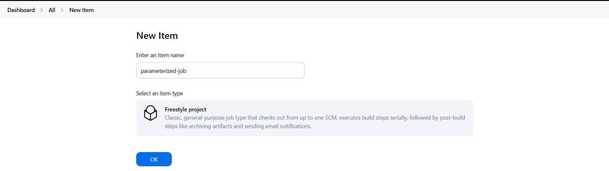
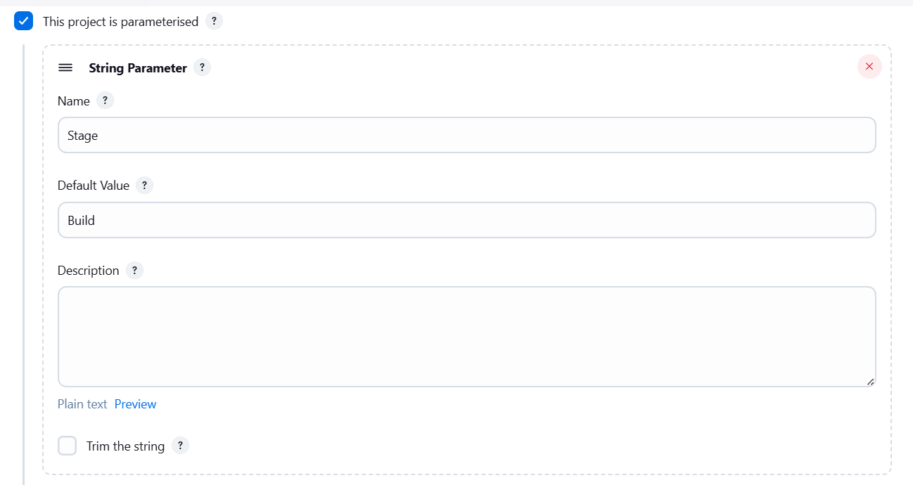
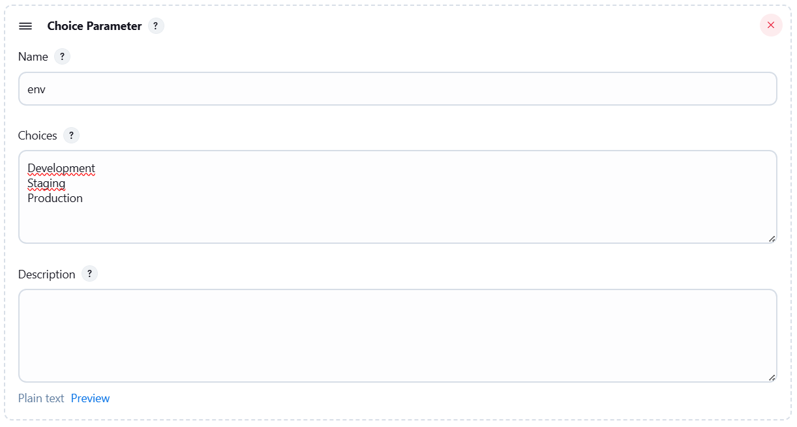
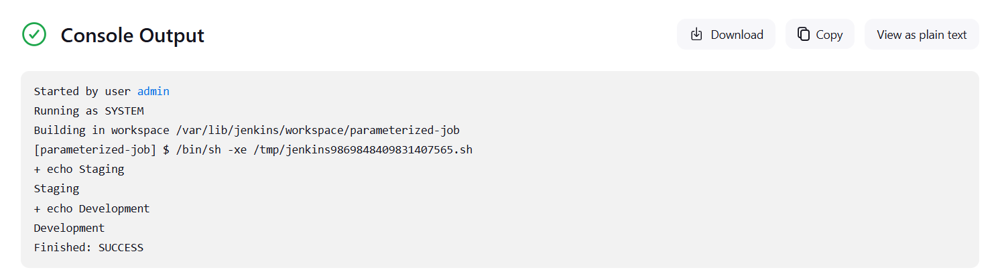

# Jenkins Parameterized Builds

A new DevOps Engineer has joined the team and will be responsible for handling Jenkins-related automation tasks. Before assigning real production work, the team decided to test a **simple parameterized Jenkins job** to demonstrate how parameters can be passed to builds.

This exercise involves creating a **parameterized job** that accepts inputs and uses them inside a shell command during the build process.

Access the Jenkins UI from the **Jenkins button on the top bar** and login using the following credentials:

```
Username: admin
Password: Adm!n321
```

---

# Steps

## 1. Create a New Jenkins Job

From the Jenkins dashboard:

1. Click **New Item**
2. Enter the job name:

```
parameterized-job
```

3. Select **Freestyle project**
4. Click **OK**

[](../screenshots/Screenshot-day-72-create-job.png)

## 2. Enable Parameterized Build

Inside the job configuration:

1. Locate the **General** section.
2. Enable the option:

```
This project is parameterised
```

This allows the job to accept input parameters when it is executed.

## 3. Add a String Parameter

Click **Add Parameter → String Parameter** and configure:

```
Name: Stage
Default Value: Build
```

This parameter represents the stage of the pipeline.

[](../screenshots/Screenshot-day-72-string-parameter.png)

## 4. Add a Choice Parameter

Click **Add Parameter → Choice Parameter** and configure:

[](../screenshots/Screenshot-day-72-choice-parameter.png)

This parameter allows the user to select the environment in which the job will run.

## 5. Configure Build Step

Scroll to the **Build** section.

Click:

```
Add build step → Execute Shell
```

Add the following command:

```bash
echo $Stage
echo $env
```

This command prints the parameter values during the build execution.

## 6. Run the Job

After saving the configuration:

1. Click **Build with Parameters**
2. Set parameters:
3. Click **Build**

## 7. Verify the Console Output

Open the build result and select **Console Output**.
[](../screenshots/Screenshot-day-72-run-the-job.png)

This confirms that the parameters were correctly passed and used during execution.

---

# Good to Know

## What are Parameterized Builds?

Parameterized builds allow Jenkins jobs to accept **dynamic inputs at runtime**, making the job reusable for multiple environments or scenarios.

Examples include:

* Deploying to **Development, Staging, or Production**
* Running tests on **different configurations**
* Selecting **branches or versions** for builds

---

## Parameter Types in Jenkins

| Parameter Type | Description                           |
| -------------- | ------------------------------------- |
| String         | Accepts user text input               |
| Choice         | Dropdown list with predefined options |
| Boolean        | Checkbox (true/false)                 |
| Password       | Hidden input for sensitive data       |
| File           | Upload file as build parameter        |

---

## How Jenkins Uses Parameters

When parameters are defined:

* Jenkins automatically exposes them as **environment variables**
* They can be accessed in shell scripts using:

```
$PARAMETER_NAME
```

Example:

```bash
echo $Stage
echo $env
```
