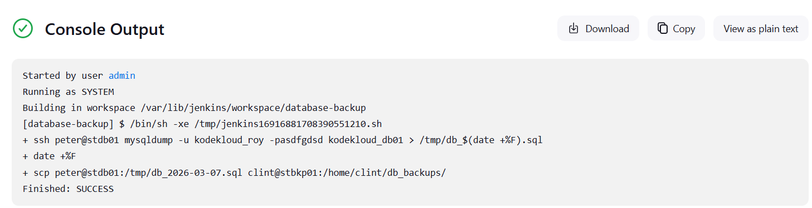

# Jenkins Database Backup Job

This task requires creating a **Jenkins job to automate database backups** in the Stratos Datacenter environment. The job will generate a database dump from the **Nautilus Database Server** and copy it to the **Nautilus Backup Server** every 10 minutes.

To access Jenkins, click the **Jenkins button** in the top navigation bar and login with:

```
Username: admin
Password: Adm!n321
```

---

# Task Requirements

1. Create a Jenkins job named **`database-backup`**.
2. Configure it to take a dump of the **`kodekloud_db01`** database located on the **Database Server (`stdb01`)**.
3. Use database credentials:

```
User: kodekloud_roy
Password: asdfgdsd
```

4. The backup file must follow this naming format:

```
db_$(date +%F).sql
```

Example:

```
db_2026-03-07.sql
```

5. Copy the backup file to the **Backup Server (`stbkp01`)** under:

```
/home/clint/db_backups
```

6. Schedule the job to run **every 10 minutes** using:

```
*/10 * * * *
```

---

# Infrastructure Overview

| Server    | Role              | User    |
| --------- | ----------------- | ------- |
| `stdb01`  | Database Server   | peter   |
| `stbkp01` | Backup Server     | clint   |
| `jenkins` | Automation Server | jenkins |

---

# Steps

## 1. Login to Jenkins Server

From the jumphost connect to the Jenkins server:

```bash
ssh jenkins@172.16.238.19
```

# 2. Generate SSH Keys

Create SSH keys for passwordless authentication.

```bash
ssh-keygen -t rsa
```

Press **Enter** for all prompts.

Keys will be stored in:

```
/var/lib/jenkins/.ssh/id_rsa
/var/lib/jenkins/.ssh/id_rsa.pub
```

# 3. Configure Passwordless SSH

### Jenkins → Database Server

```bash
ssh-copy-id peter@172.16.239.10
```

Test connection:

```bash
ssh peter@172.16.239.10
```

### Jenkins → Backup Server

```bash
ssh-copy-id clint@stbkp01
```

Test connection:

```bash
ssh clint@stbkp01
```

Both connections should **work without password prompts**.

# 4. Create Jenkins Job

Navigate to:

```
Dashboard → New Item
```

Create a **Freestyle Project** named:

```
database-backup
```

# 5. Configure Build Trigger

Enable:

```
Build periodically
```

Add the cron schedule:

```
*/10 * * * *
```

This runs the job every **10 minutes**.

# 6. Configure Build Step

Add:

```
Build Step → Execute Shell
```

Insert the following script:

```bash
ssh peter@stdb01 "mysqldump -u kodekloud_roy -pasdfgdsd kodekloud_db01 > /tmp/db_\$(date +%F).sql"

scp peter@stdb01:/tmp/db_$(date +%F).sql clint@stbkp01:/home/clint/db_backups/
```

This script performs:

1. Database dump on **Database Server**
2. Copy backup to **Backup Server**

# 7. Build the Job

Click:

```
Build Now
```

Check logs:

[](../screenshots/Screenshot-day-74-check-logs.png)

---

# Good to Know

## Database Backup Automation

Automating database backups ensures:

* Regular data protection
* Quick disaster recovery
* Reduced manual maintenance
* Consistent backup scheduling

---

# MySQL Backup Tools

Common MySQL backup utilities:

| Tool                 | Description                         |
| -------------------- | ----------------------------------- |
| `mysqldump`          | Logical backup using SQL statements |
| `mysqlpump`          | Parallel logical backup             |
| `Percona XtraBackup` | Physical backup solution            |
| `Binary Logs`        | Enable point-in-time recovery       |


# SSH Key Authentication

Using SSH keys allows:

* Secure server communication
* Automation without password prompts
* Reliable CI/CD pipelines
* Reduced risk of credential exposure

Commands used:

```bash
ssh-keygen
ssh-copy-id
```


# Jenkins Cron Scheduling

Cron format:

```
* * * * *
│ │ │ │ │
│ │ │ │ └── Day of week
│ │ │ └──── Month
│ │ └────── Day of month
│ └──────── Hour
└────────── Minute
```

Example:

```
*/10 * * * *
```

Runs every **10 minutes**.


# Backup Best Practices

* Store backups on **separate servers**
* Use **timestamped filenames**
* Compress backups for storage efficiency
* Encrypt sensitive database dumps
* Test restore procedures regularly


# Jenkins Automation Workflow

```
Jenkins
   │
   │ SSH
   ▼
Database Server (stdb01)
   │
   │ mysqldump
   ▼
db_YYYY-MM-DD.sql
   │
   │ SCP
   ▼
Backup Server (stbkp01)
/home/clint/db_backups
```
