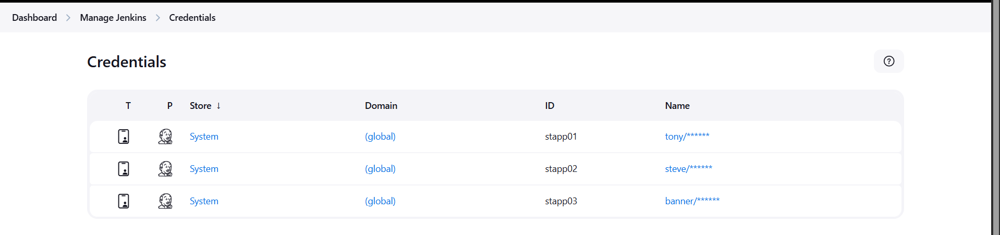

# Jenkins Slave Nodes

The Nautilus DevOps team has installed and configured new Jenkins server in Stratos DC which they will use for CI/CD and for some automation tasks. There is a requirement to add all app servers as slave nodes in Jenkins so that they can perform tasks on these servers using Jenkins. Find below more details and accomplish the task accordingly.

Click on the Jenkins button on the top bar to access the Jenkins UI. Login using username admin and password Adm!n321.

1. Add all app servers as SSH build agent/slave nodes in Jenkins. Slave node name for app server 1, app server 2 and app server 3 must be App_server_1, App_server_2, App_server_3 respectively.

2. Add labels as below:
  
   - App_server_1 : stapp01
   - App_server_2 : stapp02
   - App_server_3 : stapp03

3. Remote root directory for
   - App_server_1 must be `/home/tony/jenkins`,
   - App_server_2 must be `/home/steve/jenkins` and
   - App_server_3 must be `/home/banner/jenkins`.

4. Make sure slave nodes are online and working properly.

Note:

1. You might need to install some plugins and restart Jenkins service. So, we recommend clicking on Restart Jenkins when installation is complete and no jobs are running on plugin installation/update page i.e update centre. Also, Jenkins UI sometimes gets stuck when Jenkins service restarts in the back end. In this case, please make sure to refresh the UI page.

2. For these kind of scenarios requiring changes to be done in a web UI, please take screenshots so that you can share it with us for review in case your task is marked incomplete. You may also consider using a screen recording software such as loom.com to record and share your work.

## Steps

### 0. Update Plugins and Restart Jenkins

Open Jenkins and navigate to:

```
Manage Jenkins → Plugins
```

Install the required plugin:

* **SSH Build Agents**

After installation, restart Jenkins from the **Update Center**.
If the Jenkins UI freezes after restart, simply **refresh the browser page**.

### 1. Create Credentials for the App Servers

Navigate to:

```
Manage Jenkins → Credentials → System → Global Credentials → Add Credentials
```

Create credentials for each application server using **Username with Password**.

Fill the following fields:

| Field       | Description                       |
| ----------- | --------------------------------- |
| Username    | Linux user of the server          |
| Password    | Password of the server user       |
| ID          | Unique identifier used by Jenkins |
| Description | Optional                          |

Create the following credentials:

| Server       | Username | Credential ID |
| ------------ | -------- | ------------- |
| App Server 1 | tony     | stapp01       |
| App Server 2 | steve    | stapp02       |
| App Server 3 | banner   | stapp03       |

Example credentials created in Jenkins:

[](../screenshots/Screenshot-day-75-credential.png.png)

These credentials allow Jenkins to **connect to the servers via SSH**.

### 2. Install Java on All App Servers

Jenkins agents require **Java** to run the Jenkins agent process.

Login to each application server and install Java:

```bash
sudo yum install java-21-openjdk -y
```

Verify installation:

```bash
java -version
```

Java is required because Jenkins runs the **agent process using `agent.jar`**.

---

### 3. Add Jenkins Agent Nodes

Navigate to:

```
Manage Jenkins → Nodes → New Node
```

Create three nodes with the following configuration.

---

#### App_server_1

| Field                 | Value                 |
| --------------------- | --------------------- |
| Node Name             | App_server_1          |
| Labels                | stapp01               |
| Remote Root Directory | /home/tony/jenkins    |
| Launch Method         | Launch agents via SSH |
| Host                  | stapp01               |
| Credentials           | stapp01               |

---

#### App_server_2

| Field                 | Value                 |
| --------------------- | --------------------- |
| Node Name             | App_server_2          |
| Labels                | stapp02               |
| Remote Root Directory | /home/steve/jenkins   |
| Launch Method         | Launch agents via SSH |
| Host                  | stapp02               |
| Credentials           | stapp02               |

---

#### App_server_3

| Field                 | Value                 |
| --------------------- | --------------------- |
| Node Name             | App_server_3          |
| Labels                | stapp03               |
| Remote Root Directory | /home/banner/jenkins  |
| Launch Method         | Launch agents via SSH |
| Host                  | stapp03               |
| Credentials           | stapp03               |

After saving, Jenkins will connect via SSH and start the agent process.

Example of nodes successfully connected:


---

### 4. Create a Test Freestyle Job

Create a new job:

```
Dashboard → New Item → Freestyle Project
```

Job name:

```
testNodes
```

Configure the job:

Enable:

```
Restrict where this project can run
```

Enter the label of the node where the job should run, for example:

```
stapp02
```

---

### 5. Add Build Step

Add build step:

```
Build Steps → Execute Shell
```

Insert the following commands:

```bash
echo "Hello from Agent"
pwd
echo $USER
```

These commands will confirm the job is executed on the **remote agent server**.

---

### 6. Run the Job

Click:

```
Build Now
```

Open **Console Output**.

Successful execution example:


Output explanation:

| Output           | Meaning                             |
| ---------------- | ----------------------------------- |
| Hello from Agent | Command executed on agent           |
| pwd              | Shows Jenkins workspace directory   |
| echo $USER       | Displays Linux user running the job |

Example workspace path:

```
/home/steve/jenkins/workspace/testNodes
```

---

### 7. Verify Successful Execution

The job should finish with:

```
Finished: SUCCESS
```

This confirms:

* Jenkins successfully connected to the **agent node**
* Commands were executed **on the remote server**
* The Jenkins distributed build setup is working correctly.

## Good to Know 

### Jenkins Distributed Builds

- **Master-Slave Architecture**: Master coordinates, slaves execute
- **Scalability**: Distribute build load across multiple machines
- **Isolation**: Separate build environments
- **Resource Optimization**: Use appropriate hardware for different tasks

### Build Agents (Slaves)

- **SSH Agents**: Connect via SSH protocol
- **JNLP Agents**: Java Web Start agents
- **Docker Agents**: Containerized build environments
- **Cloud Agents**: Dynamic agents in cloud platforms

### Agent Configuration

- **Labels**: Tag agents for specific job requirements
- **Remote Directory**: Workspace location on agent
- **Executors**: Number of concurrent builds per agent
- **Node Properties**: Environment variables and tools

### Benefits

- **Parallel Execution**: Run multiple builds simultaneously
- **Environment Diversity**: Different OS, tools, configurations
- **Load Distribution**: Prevent master overload
- **Fault Tolerance**: Continue builds if some agents fail
