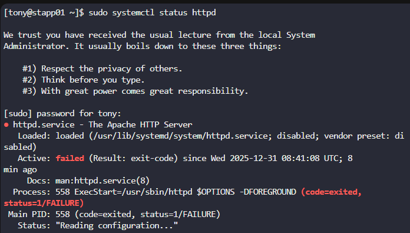
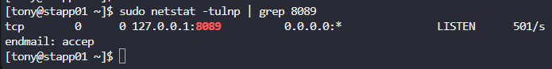

#  Apache Service Not Reachable on Port 8089

##  Incident Overview

The monitoring system reported that **Apache was not reachable on port 8089** on **App Server 1 (stapp01)** in the **Stratos Datacenter**.

The issue could originate from:

* A stopped or failed Apache service
* A port conflict
* Firewall restrictions
* Network reachability problems

The objective was to **restore access to Apache from the jump host** without modifying any application content.

---

## 🎯 Goal

* Ensure Apache is **running and listening on port 8089**
* Ensure the service is **reachable from the jump host**
* Fix the issue **without changing `index.html`**
* Preserve system security

Final validation command:

```bash
curl http://stapp01:8089
```

---

## 🛠️ Investigation & Resolution Steps

### 1- Check Apache Service Status

Apache was found in a **failed state**:

```bash
sudo systemctl status httpd
```
[](../screenshots/Screenshot-day-12-httpd-failed-status.png)
Key error observed:

```
Address already in use: AH00072: make_sock: could not bind to address 0.0.0.0:8089
```

 Conclusion:
Apache could not start because **port 8089 was already in use**.

---

### 2- Identify the Port Conflict

To identify which service was using the port:

```bash
sudo netstat -tulnp | grep 8089
```

Result:
[](../screenshots/Screenshot-day-12-port-used-by-sendmail-service.png)
```
127.0.0.1:8089  LISTEN  sendmail
```

📌 Conclusion:
The **sendmail service** was occupying port **8089**, preventing Apache from binding to it.

---

### 3- Resolve the Port Conflict

Since Apache **must** run on port 8089 (task requirement), the conflicting service was stopped:

```bash
sudo systemctl stop sendmail
sudo systemctl disable sendmail
```

This safely freed the port without impacting the task scope.

---

### 4- Restart and Enable Apache

After freeing the port, Apache was restarted:

```bash
sudo systemctl start httpd
sudo systemctl enable httpd
```

Verification:

```bash
sudo systemctl status httpd
```

Expected state:

[](../screenshots/Screenshot-day-12-active-httpd)

```
Active: active (running)
Running, listening on port 8089
```

---

### 5- Local Service Validation

Apache accessibility was verified locally on the app server:

```bash
curl http://172.16.238.10:8089
```

[](../screenshots/Screenshot-day-12-connection-failed.png)

✔ Apache responded successfully
❌ However, access from the jump host still failed

---

### 6- Identify Firewall Restrictions

From the jump host:

```bash
curl http://172.16.238.10:8089
```

Error:

```
No route to host
```

This indicated a **firewall-level block**.

Checking firewall rules on the app server:

```bash
sudo iptables -L -n
```

[](../screenshots/Screenshot-day-12-port-rule-22-allowed.png)


Observation:

* Only SSH (port 22) was allowed
* A `REJECT` rule blocked all other incoming traffic
* Port 8089 was not permitted

---

### 7- Allow Apache Port via iptables

A rule was inserted **before the REJECT rule** to allow Apache traffic:

```bash
sudo iptables -I INPUT 4 -p tcp --dport 8089 -j ACCEPT
```

[](../screenshots/Screenshot-day-12-enable-port-8089.png)

Verification:

```bash
sudo iptables -L -n
```

---

### 8- Final Validation from Jump Host

```bash
curl http://stapp01:8089
```

[](../screenshots/Screenshot-day-12-apatch-server-test.png)


- Apache page successfully loaded
- Issue resolved

---

##  Final Outcome

| Checkpoint     | Status         |
| -------------- | -------------- |
| Apache service | ✅ Running      |
| Port conflict  | ✅ Resolved     |
| Firewall rule  | ✅ Added        |
| Remote access  | ✅ Working      |
| index.html     | ❌ Not modified |

---

## 🧠 Good to Know

### 🔍 Common Causes of “Service Not Reachable”

* Port already in use by another service
* Service bound to localhost only
* Firewall blocking inbound traffic
* Service running but not listening externally

---

---
### Port Conflict Resolution

* Identification: Use netstat -tlnup or ss -tlnup
* Process Discovery: lsof -i :port shows which process uses port
* Solutions: Change port, stop conflicting service, or reconfigure
* Prevention: Document port assignments, use port ranges

---

###  Useful Troubleshooting Commands

* **Check service status**

  ```bash
  systemctl status httpd
  ```

* **Identify port usage**

  ```bash
  netstat -tulnp
  ss -tulnp
  ```

* **Check firewall rules**

  ```bash
  iptables -L -n
  ```

* **Test connectivity**

  ```bash
  curl
  telnet
  ```

---

### 🔐 Firewall Best Practices

* Firewalls evaluate rules **top to bottom**
* A final `REJECT` rule requires **explicit ACCEPT rules**
* Open **only required ports**
* Avoid disabling the firewall entirely


