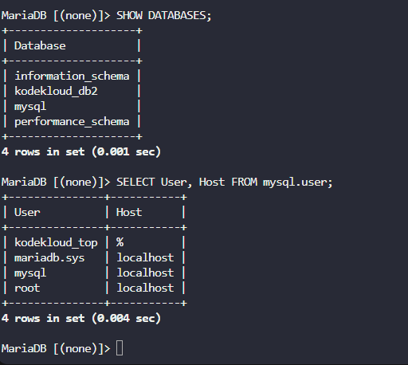
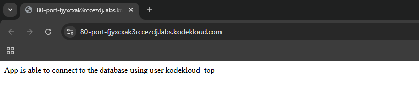

# 🌐 WordPress Infrastructure Setup – Stratos Datacenter

xFusionCorp Industries deployed a multi-tier infrastructure to host a WordPress website.
The shared directory `/vaw/www/html` is already mounted on all App Servers under `/var/www/html`.

This task ensures:

* Web servers are correctly configured
* Database access is secure and functional
* Application connectivity works through the Load Balancer (LBR)

---

## 🛠️ Fix Steps (Corrected & Complete)

### 1️⃣ Install Apache, PHP, and Dependencies (All App Servers)

Run the following command **on each App Server**:

```bash
sudo yum install -y httpd php php-mysqlnd php-gd php-xml php-mbstring
```

**One-line explanation:**
➡ Installs Apache web server, PHP runtime, and required PHP extensions for WordPress.

🔹 **What each package does:**

* **httpd** → Apache web server to handle HTTP requests
* **php** → Executes WordPress PHP code
* **php-mysqlnd** → Allows PHP to communicate with MariaDB
* **php-gd** → Image processing (media uploads, thumbnails)
* **php-xml** → XML handling used by WordPress
* **php-mbstring** → Handles multi-byte characters (UTF-8)

---

### 2️⃣ Enable Apache Service

```bash
sudo systemctl enable httpd
```

➡ Ensures Apache starts automatically after reboot.

---

### 3️⃣ Configure Apache to Listen on Port 3002

```bash
sudo vi /etc/httpd/conf/httpd.conf
```

➡ Opens Apache main configuration file.

```apache
Listen 3002
```
[](../screenshots/Screenshot-day-18-config-httpd-port.png.png)

➡ Changes Apache listening port from default to **3002**.

---

### 4️⃣ Restart and Verify Apache

```bash
sudo systemctl restart httpd
```

➡ Applies the new Apache configuration.

```bash
sudo systemctl status httpd
```

➡ Confirms Apache is running and listening on port **3002**.

[](../screenshots/Screenshot-day-18-httpd-service-running.png)

### Install MariaDB server:

```bash
sudo yum install -y mariadb-server
```


### 3️⃣ Enable and Start MariaDB (DB Server)

```bash
sudo systemctl enable mariadb
```

➡ Starts MariaDB automatically on system boot.

```bash
sudo systemctl start mariadb
```

➡ Launches the MariaDB service.

```bash
sudo systemctl status mariadb
```

➡ Confirms MariaDB is running successfully.

[](../screenshots/Screenshot-day-18-mariaDB-service-running-on-DB-server.png)

---

### 4️⃣ Access MariaDB as Root

```bash
sudo mariadb -u root
```

➡ Logs into MariaDB using root via Unix socket authentication.

📸 **Screenshot: MariaDB Root Login Successful**

---

### 5️⃣ Create Database and User

```sql
CREATE DATABASE kodekloud_db2;
```

➡ Creates the application database.

```sql
CREATE USER 'kodekloud_top'@'%' IDENTIFIED BY 'YchZHRcLkL';
```

➡ Creates a database user accessible from App Servers.

```sql
GRANT ALL PRIVILEGES ON kodekloud_db2.* TO 'kodekloud_top'@'%';
```

➡ Gives full access on the database to the application user.

```sql
FLUSH PRIVILEGES;
```

➡ Reloads permission tables immediately.


[](../screenshots/Screenshot-day-18-database-and-user-created-successfully.png)

---

### 6️⃣ Verify Database Configuration

```sql
SHOW DATABASES;
```

➡ Confirms the database exists.

```sql
SELECT User, Host FROM mysql.user;
```

➡ Confirms user and remote access permissions.

[](../screenshots/Screenshot-day-18-database-and-user-verification.png)

---

### 7️⃣ Final Application Test via Load Balancer

* Open the **LBR URL**
* Click **App** from the top menu

✅ Expected message:

```
App is able to connect to the database using user kodekloud_top
```

[](../screenshots/Screenshot-day-18-final-application-connectivity-test.png)

---

## 🐬 MySQL / MariaDB Cheat Sheet

| Command                                    | Purpose               |
| ------------------------------------------ | --------------------- |
| `sudo mariadb -u root`                     | Login as MariaDB root |
| `SHOW DATABASES;`                          | List all databases    |
| `USE db_name;`                             | Select a database     |
| `CREATE DATABASE db;`                      | Create a new database |
| `CREATE USER 'u'@'%' IDENTIFIED BY 'p';`   | Create a user         |
| `GRANT ALL PRIVILEGES ON db.* TO 'u'@'%';` | Grant permissions     |
| `FLUSH PRIVILEGES;`                        | Reload permissions    |
| `SELECT User, Host FROM mysql.user;`       | List users            |
| `EXIT;`                                    | Exit MariaDB shell    |

---

Here is an **expanded, clean, and exam-ready “Good to Know” section**, written in the **same style as your example**, but **richer and more complete**.
You can **paste this directly** into your README.

---

## ℹ️ Good to Know?

### 🔹 LAMP Stack Architecture

* **Linux**: Operating system providing stability and security
* **Apache**: Web server that receives and serves HTTP requests
* **MariaDB (MySQL)**: Relational database storing application data
* **PHP**: Server-side language that runs WordPress logic

👉 WordPress is built entirely on the LAMP stack.

---

### 🔹 Web Application Request Flow

1. **Client Request**
   Browser sends an HTTP request to the Load Balancer.
2. **Load Balancer Routing**
   Request is forwarded to one of the App Servers.
3. **Apache Processing**
   Apache receives the request on port **3002**.
4. **PHP Execution**
   Apache passes PHP files to the PHP interpreter.
5. **Database Query**
   PHP connects to MariaDB to fetch or store data.
6. **Response to Client**
   Generated HTML is returned to the browser.

---

### 🔹 Load Balancer Role

* Distributes traffic across multiple App Servers
* Prevents overloading a single server
* Improves **availability** and **scalability**
* Acts as the only public entry point

---

### 🔹 Shared Storage Importance

* Ensures all App Servers serve the same WordPress files
* Prevents file inconsistency between servers
* Simplifies updates and maintenance
* Critical for load-balanced environments

---

### 🔹 Database Security Best Practices

* **Remote Access**
  `'user'@'%'` → Allows connections from any host (used in this task)
* **Local Only Access**
  `'user'@'localhost'` → Most secure, DB-only applications
* **Restricted Network Access**
  `'user'@'192.168.1.%'` → Allows a specific subnet
* **Avoid Root for Applications**
  Always use a dedicated DB user

---

### 🔹 Why Unix Socket Authentication Is Used

* Root DB access allowed only via OS root user
* No password exposed or transmitted
* More secure than password-based root login
* Common in enterprise Linux environments

---

### 🔹 Performance Optimization Concepts

* **Connection Pooling**
  Reuse database connections to reduce overhead
* **Query Optimization**
  Use indexes to speed up data retrieval
* **Caching**
  Use Redis or Memcached to reduce DB load
* **Load Balancing**
  Spread traffic across servers for better response time

---

### 🔹 Why Custom Port (3002) Is Used

* Avoids conflicts with default ports (80/443)
* Forces traffic to flow through the Load Balancer
* Improves security and traffic control
* Common in internal enterprise networks

---

### 🔹 DevOps Best Practices Demonstrated

* Separation of concerns (Web vs DB)
* Least privilege access
* High availability design
* Scalable infrastructure
* Production-ready architecture

---

### ✅ Key Takeaway

> This setup reflects a real-world, production-grade WordPress deployment using DevOps best practices for security, scalability, and reliability.

---

If you want next, I can:

* Make a **shorter exam summary**
* Add a **diagram explanation**
* Convert this into **interview Q&A**

Just tell me 💡

